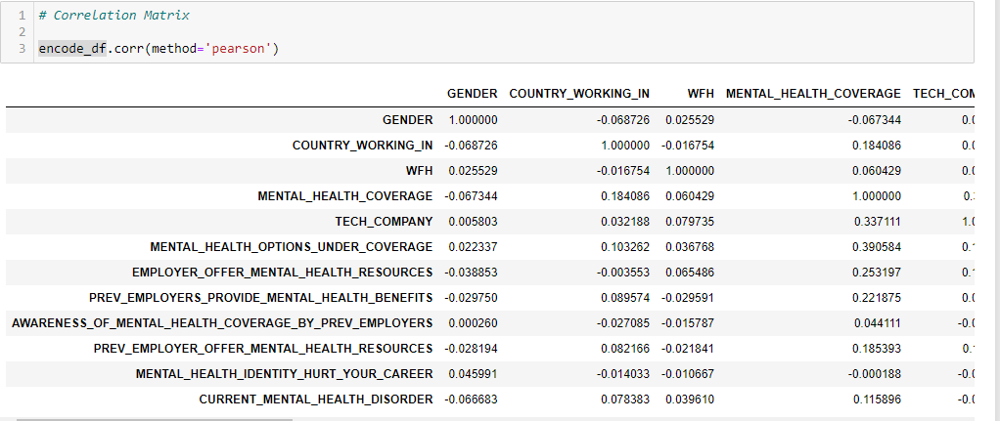
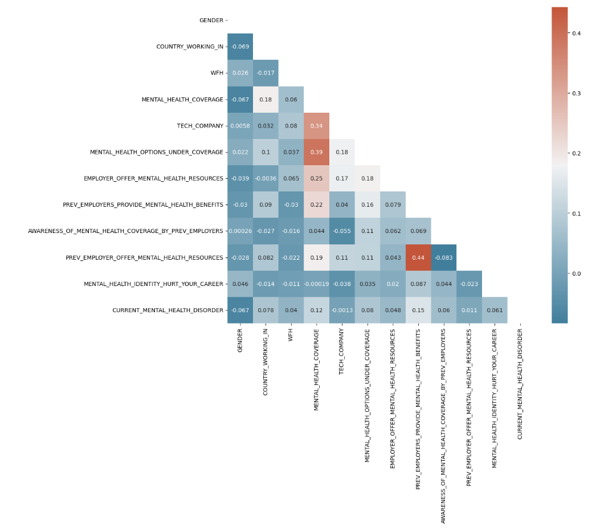

# Mental Health and Employment 
***Bradley Caldwell, Ariana Davis, and Stacey Marotta***

## List of Technologies

- pgAdmin with postgresSQL
- Jupyter Notebooks with Python
- Visual Studio Code
- Tableau

## Communication Plan

Our team created a group on `Slack` in order to communicate and share links with each other. We also created a recurring `Zoom` link and session to meet on a weekly basis and discuss where we are at with our project, as well as what tasks we still need to accomplish to get each deliverable completed. Our team has been really open with working together and offering help to one another when needed.

## Part 1 - Project Intro and Data Exploration

### Overview

The purpose of this analysis is to use `Supervised Machine Learning` to understand whether or not employers are providing healthcare benefits that includes mental healthcare in the workplace. Our project would like to examine any relationships between mental health and employment. 

### Data Source 

The dataset selected was survey data that asked participants to talk about their experiences with healthcare and mental health in the workplace. We found the Open Sourcing Mental Illness(OSMI) [website](https://osmihelp.org/research.html) dedicated to getting people to talk about mental health and the resources provided to the tech. and open source communities. Our group felt that this would be would be a decent representation of relationships of mental health and employment. 

### Question

Does your employer provide healthcare benefits that include mental healthcare?

### Data Exploration

Preliminary Data Preprocessing
1. Correlation Matrix

2. Heat Map

3. Plots

### Feature Selection and Engineering

We selected our features based on three things:

1. Target

    Our target was ‘Mental Health Coverage” and whether or not a company offers it as a benefit. So, when choosing our targets we wanted to make sure that they were variables that could help predict that in some way.

2. Interest

    We also chose features on interest; if two variables could be associated with one another, or have a casual relationship based on a negative or positive correlation. For example, mental health coverage in tech,  mental health coverage while working from home?, and mental health coverage based on the country that you live in.

3. Future Analyses & Recommendations
     Comparing gender with current mental health disorders, and whether or not mental health coverage could show us some results worth looking into for future analyses and research. Comparing whether or not companies offer mental health coverage with Age and current mental health disorders could possibly show recommendations to companies to offer mental health coverage to their employees or not. These are all things we were thinking of while selecting our features.

### Feature Engineering

There were a number of things we had to do in order to transform the given data into a form that was easier to interpret. First, we started off by renaming the columns so they could be more concise and easier to read while coding.

When choosing features we had columns with:
- Categorical Features; since algorithms are not designed to process textual data we decided to use one-hot encoding
- Multiple missing values; we used `fillna()` to replace all null values with NA and dropped one column with over 1000 null values

## Database

First, an ERD was created with QuickDB to create the tables, columns, and primary/foreign keys to use for the database. 

This ERD was then exported into PGAdmin to create the Team_Two Database.  After the schema was created, the data from the Mental_Health_Data.csv was imported into the appropriate tables: EMPLOYEES, and MENTAL_HEALTH. 

The EMPLOYEES table consists of: 

- ID, AGE, GENDER, COUNTRY_WORKING_IN, WFH columns.  

The MENTAL_HEALTH table consists of: 

- TECH_COMPANY, 
- MENTAL_HEALTH_OPTIONS_UNDER_COVERAGE, 
- EMPLOYER_OFFER_MENTAL_HEALTH_RESOURCES, 
- MEDICAL_COVERAGE_INCLUDING_MENTAL_HEALTH_TREATMENT, 
- PREV_EMPLOYERS_PROVIDE_MENTAL_HEALTH_BENEFITS
- AWARENESS_OF_MENTAL_HEALTH_COVERAGE_BY_PREV_EMPLOYERS, 
- PREV_EMPLOYER_OFFER_MENTAL_HEALTH_RESOURCES, 
- MENTAL_HEALTH_IDENTITY_HURT_CAREER, 
- CURRENT_MENTAL_HEALTH_DISORDER columns.

By using the query tool in PGAdmin, a join between the EMPLOYEES table, and the MENTAL_HEALTH table on the ID column was completed.  Below are the results:

## Part 2 - Model and Analysis

## Results

### Training and Testing Sets

The training and testing sets were selected using `scikit learn’s` `train_test_split()`.

### Machine Learning Model

### Hyper Parameter Tuning

### Results

The gradient boosting model showed a 0.83 accuracy score.

## Part 3 - Summary

## Storyboard

### Tableau Dashboard 

https://public.tableau.com/app/profile/stacey.marotta/viz/MentalHealthFinalProject/Dashboard1?publish=yes

## Tableau Dashboard Demo

https://public.tableau.com/app/profile/stacey.marotta/viz/MentalHealthFinalProject/Dashboard2?publish=yes

### Dashboard Demo

>>>>>>>>> Temporary merge branch 2

### Reflections and Recommendations for Future Analyses

While reflecting on this project, we had concerns that our dataset would be to small, or inefficient due to all of the null values in each column and row. One thing that we would do differently is combine multiple datasets.

Recommendations for Future Analyses
1. Does working remotely have a positive or negative impact on one's mental health and employment?
2. Do you find your employer is supportive of you and your mental health needs?
3. Do companies support employees' mental health when working from home?
4. Does having a mental health disorder have negative consequences in the workplace?  

